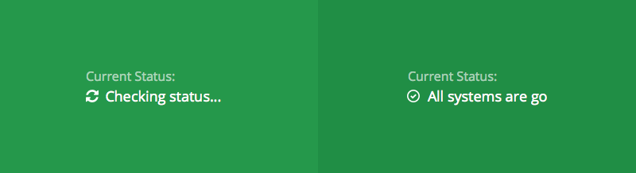

# Sorry&#8482; Status Page Link

> A Javascript plugin which creates a dynamic link to your status page, displaying the current state of afairs for your audience to see. As used on our own site [https://www.sorryapp.com](https://www.sorryapp.com)



## Installing The Plugin

### 1. Add an HTML Link

Wherever on the page you'd like to see the dynamic link. You can specify which pages you want updates to be sourced from by including your Page ID in the `data-status-link-for` attribute.

```html
<a href="https://status-bar-test.sorryapp.com" data-status-link-for="f1ff551f" title="Visit our status page">System Status</a>
```

### 2. Include the Javascript 

Just before the closing ```</ body>``` tag, this JS will do the clever stuff to transform your basic HTML link above into something more inteligent.

```html
<script src="//code.sorryapp.com/status-page-link/0.latest/status-page-link.min.js"></script>
```

#### Not sure what your Page ID is?

If the address of your status page is ```http://xxxxxx.sorryapp.com``` then ```xxxxxxx``` is what you need to use as the data attribute. This unique ID can also be found in the browsers address bar within the app. ```https://app.sorryapp.com/pages/xxxxx```

## Styling The Plugin

If you want to custom style your widget, you only need create your own CSS. The markup for the widget looks as follows.

```html
<a href="https://status-bar-test.sorryapp.com" data-status-link-for="f1ff551f" title="Visit our status page">
	<small>Current Status:</small> 
	<i class="fa fa-times-circle-o" aria-hidden="true"></i>We are having issues at the moment
</a>
```

## Contributing To The Plugin

If you want to create your own custom build, or contribute to the project it’s important you know how our build and release process works.

This project uses Grunt with convenient methods for working with the project. It's how we compile our code, run tests, and more. To use it, install the required dependencies as directed and then run some Grunt commands.

### Install Grunt

From the command line:

1. Install `grunt-cli` globally with `npm install -g grunt-cli`.
2. Navigate to the root `/sorry-announce` directory, then run `npm install`. npm will look at [package.json](package.json) and automatically install the necessary local dependencies listed there.

When completed, you'll be able to run the various Grunt commands provided from the command line.

**Unfamiliar with `npm`? Don't have node installed?** That's a-okay. npm stands for [node packaged modules](http://npmjs.org/) and is a way to manage development dependencies through node.js. [Download and install node.js](http://nodejs.org/download/) before proceeding.

### Available Grunt commands

#### Build - `grunt`
Run `grunt` to run tests locally and compile the CSS and JavaScript into `/dist`.

### Troubleshooting dependencies

Should you encounter problems with installing dependencies or running Grunt commands, uninstall all previous dependency versions (global and local). Then, rerun `npm install`.

## Versioning

For transparency and insight into our release cycle, and for striving to maintain backward compatibility, This project will be maintained under the Semantic Versioning guidelines as much as possible.

Releases will be numbered with the following format:

`<major>.<minor>.<patch>`

And constructed with the following guidelines:

* Breaking backward compatibility bumps the major (and resets the minor and patch)
* New additions without breaking backward compatibility bumps the minor (and resets the patch)
* Bug fixes and misc changes bumps the patch

For more information on SemVer, please visit <http://semver.org/>.

## Authors & Contributors

**Robert Rawlins**

+ <http://twitter.com/sirrawlins>
+ <https://github.com/SirRawlins>

**Robin Geall**

+ <http://twitter.com/robingeall>

## Copyright

Copyright &copy; 2016 Sorry™ - See [LICENSE](LICENSE) for details.